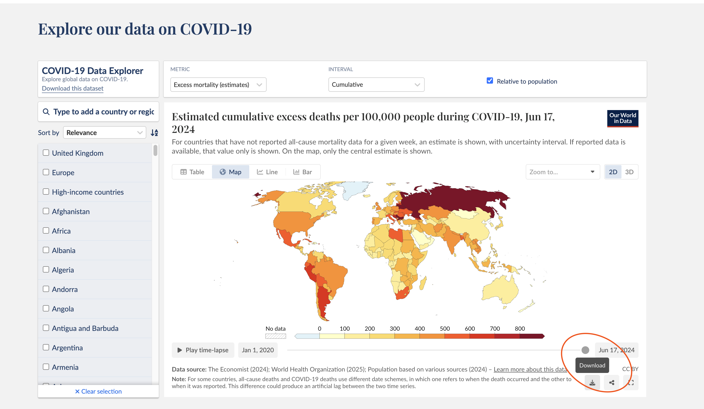

# Proyecto: Pipeline de Datos COVID-19

- Reporte: 40%
- Repositorio: 60%

El proyecto equivale al 100% de la nota del curso.

## Fundamentos y Prerrequisitos

- El proyecto debe ejecutarse en un **entorno aislado**: GitHub Codespaces, Docker o local con `venv`.
- Sólo se deben incluir en el repositorio los **archivos del proyecto**.
- **No** se deben incluir snapshots completos de datos, únicamente artefactos ligeros como tablas de perfilado o reportes finales tal como indiquen las instrucciones.
- El informe técnico debe ser incluido en el reporte en pdf

---

## Contexto

La pandemia de COVID-19 fue una de las mayores crisis de salud pública en la historia reciente. Decisiones sobre confinamientos, capacidad hospitalaria y campañas de vacunación dependieron de datos confiables y oportunos.

El dataset de [Our World in Data (OWID)](https://ourworldindata.org/covid-data) compila información diaria por país. Incluye:

- Casos diarios y acumulados.
- Muertes diarias y acumuladas.
- Vacunación (personas con al menos una dosis, vacunación completa, refuerzos).
- Tests (cuando disponibles).
- Población (para métricas per cápita).

**Fuente canónica (CSV):**
```
https://catalog.ourworldindata.org/garden/covid/latest/compact/compact.csv
```

**Particularidades:**
- Valores negativos en días individuales debido a revisiones.
- Días sin datos en algunos países.
- Diferencias en la cobertura y frecuencia de reporte.

El proyecto se centrará en **Ecuador** y un país comparativo.

---

## Bootstrapping del Proyecto

### Crear entorno y dependencias

En la raíz del repositorio, crear un archivo `requirements.txt`:

```txt
create-dagster
dagster
dagster-webserver
dagster-dg-cli
pandas
duckdb
pyarrow
openpyxl
requests
```

### Scaffold de Dagster

Para instrucciones de como crear tu primer proyecto, seguir los tutoriales oficiales, o el [tutorial de la clase](./githubcodespaces_dagster_tutorial.md)

Generar el proyecto y correr el servidor de desarrollo:

Con esto se levanta la **UI de Dagster** en http://localhost:3000, donde podrán observar la ejecución de **assets** y los resultados de **chequeos**.

> Enfoque pedagógico: Dagster, a nivel de implementación, ofrece **assets**. Estructuren todo su trabajo como assets encadenados. Los **asset checks** permiten reportar validaciones directamente en la UI.

---

## Pasos del Proyecto

### Paso 1 — Exploración Manual de Datos (EDA)

1. Ir a [OWID COVID-19 Data](https://ourworldindata.org/covid-data).
2. Filtrar por **Ecuador** y un país comparativo (el que prefieras).
3. Descargar manualmente el CSV.

   

4. Cargar el archivo en pandas o DuckDB.
5. Realizar un perfilado básico:
   - Columnas y tipos de datos.
   - Mínimo y máximo de `new_cases`.
   - Porcentaje de valores faltantes en `new_cases` y `people_vaccinated`.
   - Rango de fechas cubierto.

**IMPORTANTE**

Guardar la tabla de perfilado como `tabla_perfilado.csv` y commitearla.

---

Ahora procederemos a automatizar todo este proceso:

### Paso 2 — Lectura de Datos en Dagster (sin transformar) + Chequeos de Entrada

1) **Paso `leer_datos`**
   - Usar `requests` para obtener el CSV desde la URL canónica.
   - Leerlo con pandas y retornarlo como `DataFrame`.
   - No aplicar limpieza ni filtros todavía.

2) Agregar chequeos de entrada
   - Consumir `leer_datos` y ejecutar chequeos, crear 1 o 2.
   - Ejemplos de reglas:
     - `max(date) ≤ hoy` (no fechas futuras).
     - Columnas clave no nulas: `location`, `date`, `population`.
     - Unicidad de `(location, date)`.
     - `population > 0`.
     - `new_cases ≥ 0` (permitan negativos solo si lo documentan).
   - Reportar resultados mediante **Dagster Asset Checks** para que aparezcan en la UI.
   - Generar una pequeña tabla de resumen (en memoria) con `nombre_regla`, `estado`, `filas_afectadas`, `notas`.

> Nota: estos chequeos no deben modificar los datos. Si una regla falla, documenten en el informe la decisión (parar, alertar, continuar con warnings).

---

### Paso 3 — Procesamiento de Datos

**Paso `datos_procesados`** (consume `leer_datos`):
- Eliminar filas con valores nulos en `new_cases` o `people_vaccinated`.
- Eliminar duplicados si existen (documentar la estrategia).
- Filtrar a **Ecuador** y al país comparativo que escogiste en la primera parte.
- Seleccionar columnas esenciales: `location`, `date`, `new_cases`, `people_vaccinated`, `population`.
- Devolver un `DataFrame` listo para métricas (no persistir intermedios).

---

### Paso 4 — Cálculo de Métricas

Pueden implementar la lógica con **pandas**, **DuckDB** (SQL). 

####  A: Incidencia acumulada a 7 días por 100 mil habitantes — `metrica_incidencia_7d`
- **Cálculo paso a paso**:
  1. `incidencia_diaria = (new_cases / population) * 100000`
  2. `incidencia_7d = promedio móvil de 7 días de incidencia_diaria`
- **Interpretación**: estandariza por población y captura tendencia reciente.
- **Ejemplo (formato esperado)**:

| fecha       | país     | incidencia_7d |
|------------:|:---------|--------------:|
| 2021-07-01  | Ecuador  | 10.6          |
| 2021-07-01  | Perú     | 15.7          |

####  B: Factor de crecimiento semanal — `metrica_factor_crec_7d`
- **Cálculo paso a paso**:
  1. `casos_semana_actual = suma(new_cases de los últimos 7 días)`
  2. `casos_semana_prev = suma(new_cases de los 7 días previos)`
  3. `factor_crec_7d = casos_semana_actual / casos_semana_prev`
- **Interpretación**: >1 crecimiento, <1 decrecimiento.
- **Ejemplo (formato esperado)**:

| semana_fin  | país     | casos_semana | factor_crec_7d |
|------------:|:---------|-------------:|---------------:|
| 2021-07-07  | Ecuador  | 12,500       | 1.15           |
| 2021-07-07  | Perú     | 35,000       | 0.92           |


> Pista: Es importante leer recursos sobre la interpretacion de rangos de fechas mediante ventanas y deltas.

Luego de este paso, habremos producido dos nuevas entidades de datos.

---

### Paso 5 — Chequeos de Salida (sobre la métrica)

**Paso `chequeos_salida`** (consume las métricas producidas). Reportar resultados en la UI con **Dagster Asset Checks**.

Crea una metrica de interes, por ejemplo valida que `incidencia_7d`: `0 ≤ valor ≤ 2000`

> Pueden usar **python puro**, **pandas**, **DuckDB** o **Soda** para implementar validaciones, pero reporten los resultados con Asset Checks para que aparezcan en Dagster.

---

### Paso 6 — Exportación de Resultados

**Paso `reporte_excel_covid`**:
- Exportar únicamente resultados finales (no intermedios) a un archivo Excel o varios CSV.
    - Datos puros procesados
    - Hoja metrica 1
    - Hoja metrica 2
 
**IMPORTANTE**

Guardar los archivos del reporte y comitealo.

---

## Informe Técnico (max. 5 páginas)

> Incluir tanto detalle como sea deseado, pero limitarse a 5 páginas.

Nota: Subirlo como `reporte.pdf` junto al código.

1. **Arquitectura del pipeline**
   - Descripción de assets creados para los pasos. Recomendado incluir diagrama de las secciones respectivas.
   - Justificación de decisiones de diseño basadas en el modelado y lista de **assets** creados.

2. **Decisiones de validación**
   - Entrada: reglas aplicadas en `chequeos_entrada` y motivación.
   - Salida: reglas aplicadas en `chequeos_salida` y motivación.
   - Descubrimientos importantes en cuanto a los datos analizados

3. **Consideraciones de arquitectura**
   - Elección de pandas vs. DuckDB vs. Soda para métricas y validaciones.

4. **Resultados**
   - Tabla de las métricas implementadas y breve interpretación, asi como sumario de resultados.
   - Resumen del control de calidad (reglas, estado, filas afectadas).


---

## Criterios de Evaluación

Con el fin de realizar el proyecto se pueden referenciar:

- Herramientas de inteligencia artificial.
> Todas las decisiones deben ser justificables.

- Diapositivas del curso (incluir títulos/IDs).
- Documentación oficial:
     - Dagster Quickstart: https://docs.dagster.io/getting-started/quickstart
     - Dagster Assets: https://docs.dagster.io/concepts/assets/software-defined-assets
     - Dagster Asset Checks: https://docs.dagster.io/concepts/assets/asset-checks
     - Pandas API (rolling, groupby): https://pandas.pydata.org/docs/
     - DuckDB CSV & SQL: https://duckdb.org/docs/data/csv/overview
     - OWID COVID-19: https://ourworldindata.org/covid-data
